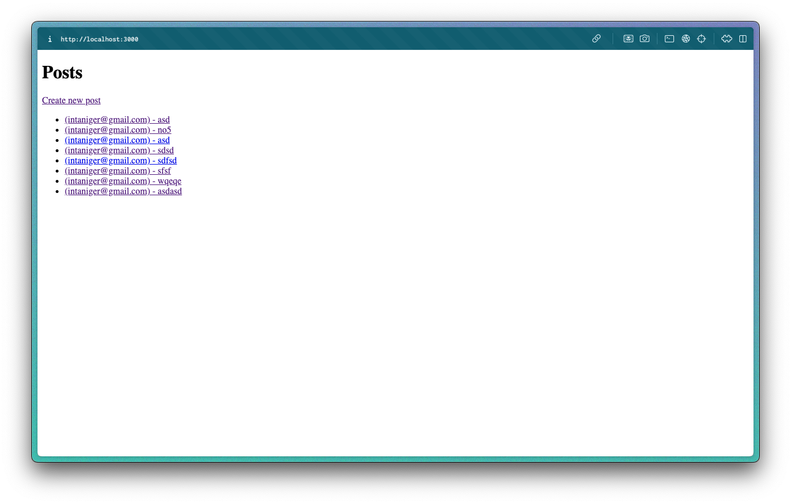
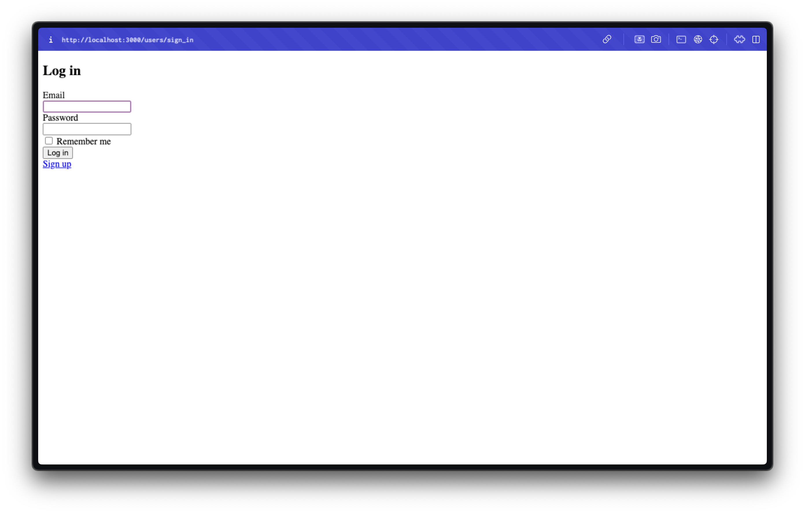

# README

This README would normally document whatever steps are necessary to get the
application up and running.

# Spin up
```sh
bin/rails server
```

Things you may want to cover:

* Ruby version: `3.3.3`

* System dependencies:`N/A`

* Configuration

* Database creation: `Using sqlite (local database)`

* Database initialization `bin/rails db:migrate`

* How to run the test suite

* Services (job queues, cache servers, search engines, etc.)

* Deployment instructions

* ...

# How to play

After spin up the server, you should find a clean page with `Create new post` button 


You'll be asked to login first, I'd suggest to click a sign-up button to register new user account


Have fun!